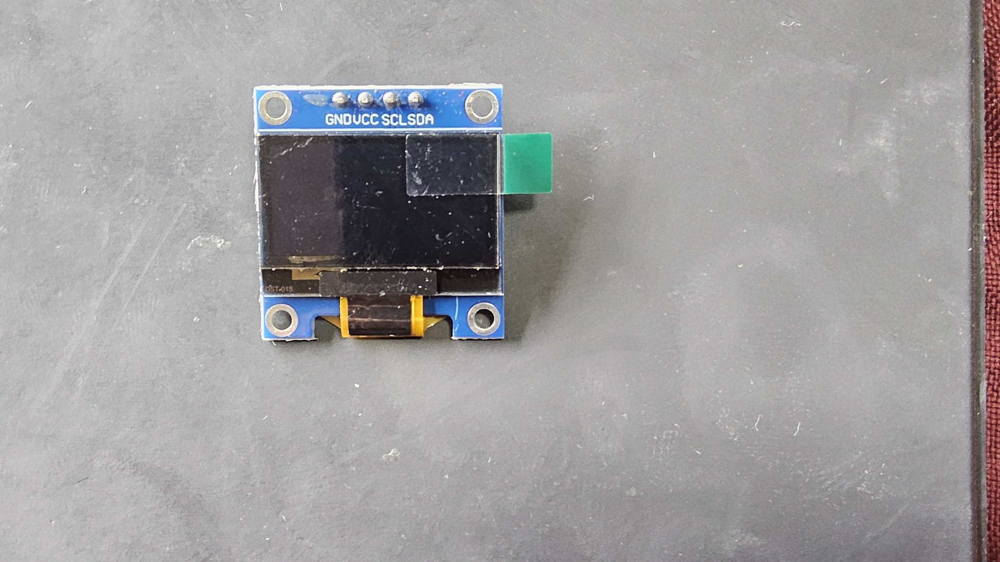
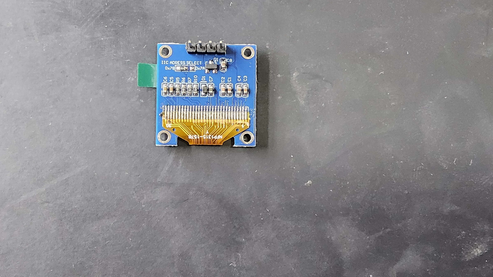
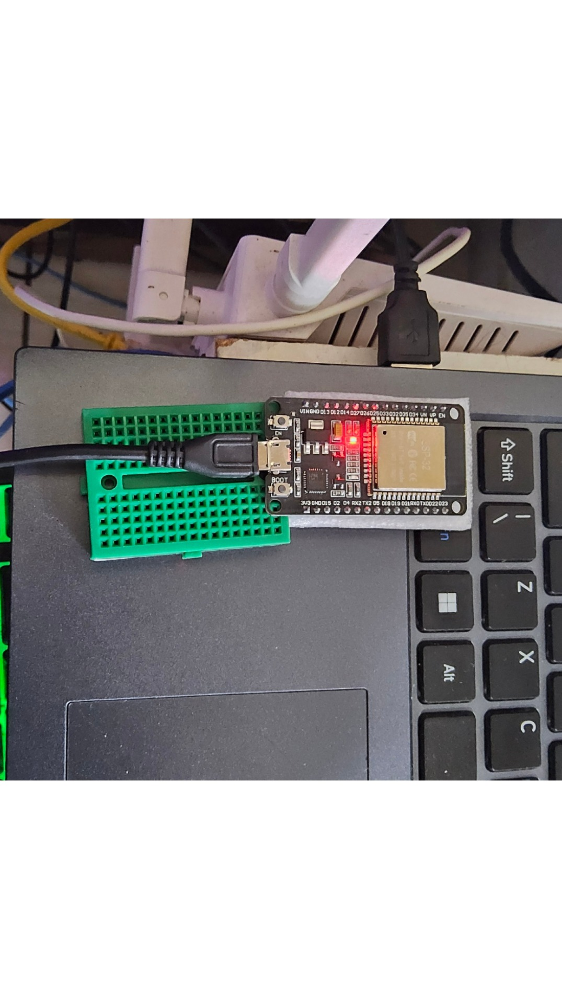
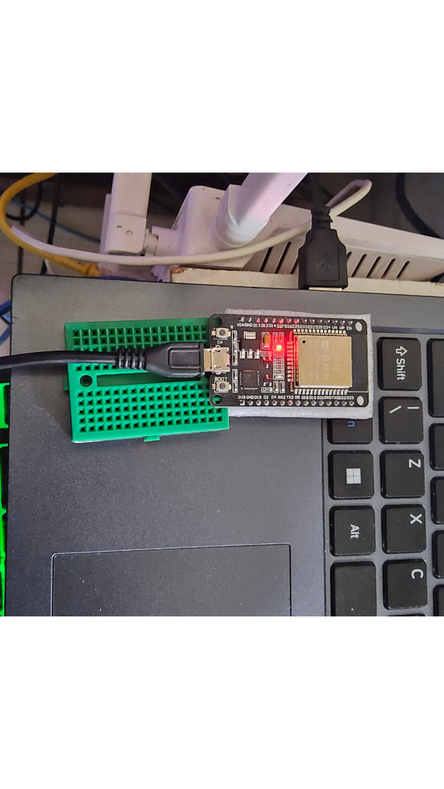
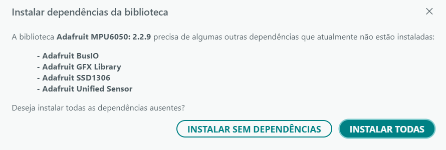
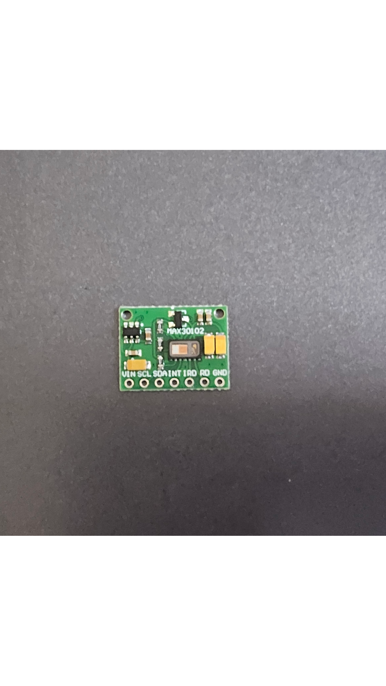
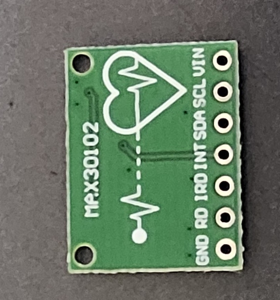

# Registro fotográfico — 29/08/2026

As imagens deste diretório foram recuperadas dos anexos da conversa “Blue Space
e Saúde Mental” e copiadas sem alteração de conteúdo. Os nomes foram
normalizados para facilitar a citação.

| Arquivo | Descrição | Tamanho | SHA-256 |
| --- | --- | ---: | --- |
| `01-oled-frente.jpg` | frente do módulo OLED, com pinos GND/VCC/SCL/SDA | 1.250.803 bytes | `BF871B24B7B0C8D68C0BB4519FDF6A26E2E7C7B8C94D8FF4C26AD728E5D4066C` |
| `02-oled-verso.jpg` | verso do módulo OLED | 1.279.602 bytes | `2AA6D8D0C48E5EF733989A9B516EF8B4962A4778C20C2624D3D03BEA16D0B417` |
| `03-dependencias-adafruit-mpu6050.png` | captura da instalação de dependências no Arduino IDE | 33.497 bytes | `B8C1733FC506BC845CABAA7DFB5E17B74037CA0AF63737C87E176A3B91D87142` |
| `04-esp32-bancada-a.jpg` | ESP32 conectado por USB na bancada | 290.097 bytes | `A51A060840CEAE96493F4AC2AF2639CF08E5F66FD7719222CDB3C96272F5F840` |
| `05-max30102-frente.png` | frente do módulo MAX30102 | 2.610.992 bytes | `0D05563D08A0A43B8B4C173A4E21B082D7BDBD0985EDF52DC871A5A6D10FCC53` |
| `06-max30102-verso.png` | verso do módulo MAX30102 | 346.601 bytes | `6D7CA06F0BFC3A83780599643B04CD7B92FE4673FEBF6F3774FA251F4EC6524F` |
| `07-esp32-bancada-b.png` | segunda imagem da mesma montagem do ESP32 | 2.132.709 bytes | `C31AF7FD169747B21E39C6AAABDECF64CFC6F1B2EF4FF118D263448C193B6A48` |

## Galeria

### OLED

### ESP32 e ambiente de desenvolvimento

### MAX30102

As fotografias documentam identificação visual e condição de bancada. Elas não
comprovam, isoladamente, especificações elétricas, identidade exata dos módulos
ou desempenho dos sensores.
