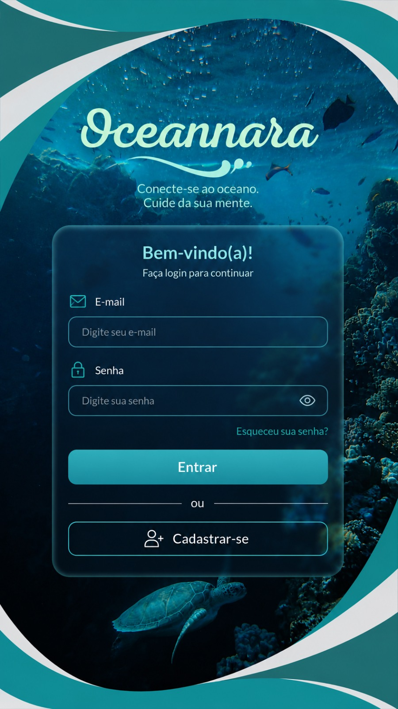
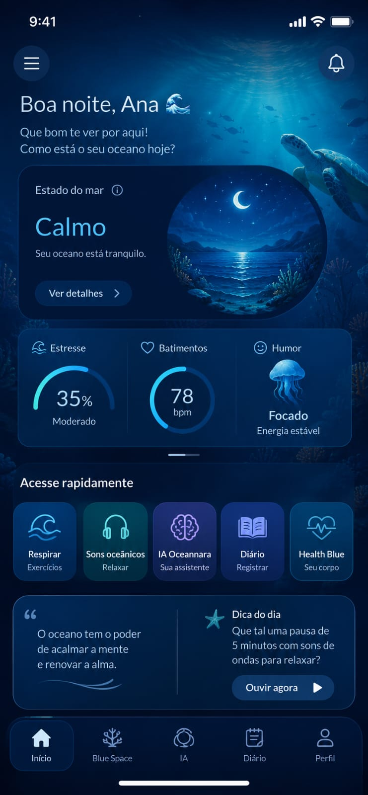

# Proposta visual para o aplicativo BluePulse

## Identificação

- data do registro: 30/08/2026;
- situação: referência conceitual em avaliação, ainda não adotada integralmente;
- finalidade: preservar as ideias visuais para discussão entre Emanuelle
  Pinheiro da Silva e o Professor Gerson Cesar Grobe de Miranda;
- relação com o aplicativo: direcionamento para os próximos incrementos da
  interface Android/Flutter.

## Materiais recebidos

Foram recebidas duas imagens conceituais: uma tela de acesso com ambientação
subaquática e uma tela de painel com cartões, indicadores e atalhos.

As imagens foram preservadas como referências históricas. A autoria, a
ferramenta de criação, a origem dos elementos fotográficos, as fontes e as
licenças ainda precisam ser confirmadas. Até essa confirmação, elas **não são
ativos aprovados para distribuição no aplicativo**.

## Elementos que podem orientar o BluePulse

- paleta de azul-marinho, azul oceânico, ciano e turquesa;
- atmosfera subaquática associada aos *Blue Spaces*;
- uso de cartões arredondados e discretamente translúcidos;
- botões grandes e áreas de toque bem definidas;
- hierarquia visual com título, estado da sessão e ações rápidas;
- navegação inferior para funções recorrentes;
- ilustrações de ondas, água, corais e vida marinha;
- combinação entre telas funcionais limpas e momentos imersivos.

O direcionamento recomendado é combinar esses elementos com a interface clara
já validada. Fundos fotográficos detalhados devem ser reservados à apresentação
e à intervenção Blue Space. Formulários, monitoramento e resultados precisam
manter leitura simples e contraste elevado.

## Adaptações necessárias ao escopo científico

| Elemento da referência | Decisão para o MVP BluePulse |
| --- | --- |
| login por e-mail e senha | não implementar; o MVP não possui contas nem nuvem |
| cadastro de usuário | não implementar; evitar dados nominais |
| saudação com nome pessoal | substituir por código anônimo da sessão |
| “Estresse 35%” | não apresentar; não existe algoritmo validado no projeto |
| “Humor focado” | permitir apenas como autorrelato, nunca como inferência do sensor |
| frequência cardíaca em BPM | exibir somente após protocolo específico de validação |
| assistente de inteligência artificial | manter fora do MVP atual |
| estado emocional calculado | substituir por qualidade do sinal e respostas declaradas |
| sons oceânicos e respiração | aproveitar na intervenção Blue Space |
| diário | adaptar para histórico local e autorrelatos não clínicos |

O aplicativo não deverá diagnosticar estresse, ansiedade ou transtornos, nem
transformar uma única medida fisiológica em estado emocional. Qualquer metáfora
como “estado do mar” deverá representar resposta fornecida pela própria pessoa
ou uma condição visual da sessão, com origem explicitada.

## Nome e arquitetura da identidade

O nome principal permanece **BluePulse**, pois identifica o projeto acadêmico,
o repositório, o firmware e o aplicativo já validado.

O nome “Oceannara”, presente em uma das referências, não será adotado
automaticamente como substituto. Ele poderá ser discutido como possível nome da
experiência imersiva ou da intervenção respiratória, caso a equipe considere
adequado e confirme sua origem.

## Plano de recursos visuais

### Imagens de fundo

Caso existam arquivos originais, deverão ser fornecidos:

1. fundo submarino vertical, sem textos, botões ou molduras;
2. fundo submarino horizontal, sem interface incorporada;
3. versão na maior resolução disponível;
4. autoria, fonte e autorização ou licença de uso.

Formatos de entrada aceitos: JPEG, PNG ou WebP. As versões finais poderão ser
convertidas e comprimidas para reduzir o tamanho do aplicativo. Textos nunca
deverão ser incorporados ao fundo; eles permanecerão em componentes Flutter
para permitir acessibilidade, tradução e adaptação a diferentes telas.

Se os arquivos originais ou direitos de uso não estiverem disponíveis, deverão
ser produzidos fundos originais para o BluePulse, com registro do método de
criação, comandos utilizados, data, versões e hashes.

### Logotipo e ícone do aplicativo

Se houver logotipo original, o formato preferencial é SVG ou PNG transparente
em alta resolução. Uma captura de tela não deve ser usada como arquivo final.

O símbolo provisório de gota já utilizado no aplicativo pode orientar um ícone
próprio do BluePulse. A versão final deverá funcionar em tamanhos pequenos,
possuir bom contraste e ser preparada como ícone adaptativo do Android.

### Ícones funcionais

Ícones comuns serão construídos com a biblioteca vetorial do Flutter, e não
como imagens separadas. Isso inclui voltar, menu, coração, diário, respiração,
Bluetooth, qualidade do sinal, alerta, reprodução e pausa. Todos deverão usar
uma linguagem visual consistente e possuir rótulos acessíveis.

### Áudio e outros estímulos

Os sons oceânicos serão tratados em etapa própria. Cada áudio deverá ter fonte,
autoria, licença, duração e hash registrados. Nenhum áudio iniciará sem uma ação
do usuário.

## Aplicação proposta por etapa do fluxo

| Tela | Tratamento visual recomendado |
| --- | --- |
| apresentação | cena oceânica com sobreposição para garantir contraste |
| código anônimo | fundo claro, formulário simples e explicação de privacidade |
| autorrelato | cartões claros, escalas legíveis e linguagem não clínica |
| escolha da fonte | cartões distintos para `simulado` e `BLE` |
| monitoramento | fundo limpo, qualidade do sinal em primeiro plano |
| intervenção | ambiente oceânico imersivo, respiração e áudio opcional |
| autorrelato final | mesma estrutura do inicial para permitir comparação |
| resumo e histórico | dados declarados e técnicos, sem interpretação diagnóstica |

## Critérios de avaliação visual

- funcionamento em telefone e tablet, nas orientações aplicáveis;
- nenhum texto incorporado a fotografias;
- leitura possível sobre todos os fundos;
- área de toque adequada e navegação de retorno consistente;
- informação compreensível sem depender apenas de cor;
- indicação permanente de dados simulados quando aplicável;
- ausência de linguagem diagnóstica;
- teste com tamanho de fonte ampliado;
- avaliação conjunta da estudante e do orientador em cada marco visual.

## Integridade dos arquivos recebidos

| Arquivo preservado | SHA-256 |
| --- | --- |
| `proposta-tela-acesso.jpeg` | `4BD5280B039507519B7FAF0098170872A9291438781D83D183B9DEF67E653A29` |
| `proposta-tela-painel.jpeg` | `73C23508602E38E7FDE9197DCA0F1553FDE61391B277F752E95CA06C9E91F23D` |

## Próxima decisão

Antes de aplicar fundos e identidade final, a equipe deverá confirmar:

- se existem os arquivos originais sem interface;
- autoria e licença dos materiais;
- se “Oceannara” é apenas parte do conceito ou nome de uma intervenção;
- preferência entre interface predominantemente clara ou escura;
- quais elementos visuais Emanuelle considera essenciais para representar sua
  proposta.
