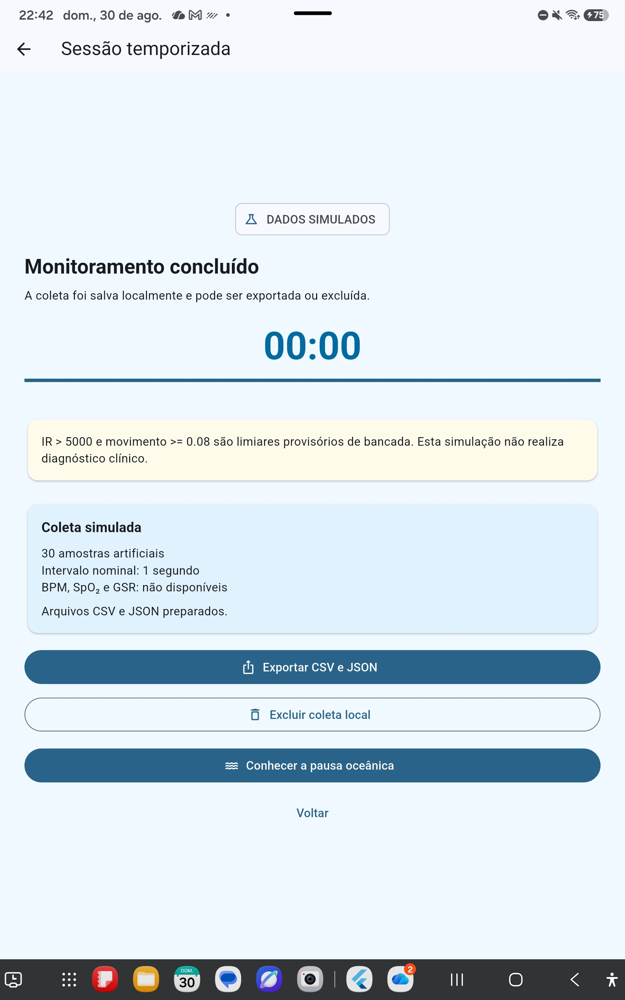

# Evidência da persistência e exportação simulada

## Identificação

- data: 30/08/2026;
- responsável pela implementação: Codex, sob orientação do Professor Gerson
  Cesar Grobe de Miranda;
- commit do código: `1fc84d8`;
- dispositivo de instalação: tablet Samsung SM-X810;
- natureza dos dados autorizados neste incremento: exclusivamente simulados.

## Objetivo

Preservar uma sessão artificial de forma auditável antes de permitir qualquer
armazenamento de amostras fisiológicas reais. O incremento deve manter a
minimização de dados, permitir exclusão controlada e deixar explícito que não
há diagnóstico nem medidas fisiológicas validadas.

## Fluxo implementado

1. O usuário executa a sessão simulada de 30 segundos.
2. Ao término, a tela informa que há 30 amostras artificiais ainda não salvas.
3. A gravação só ocorre após a ação **Salvar coleta simulada**.
4. O arquivo persistente fica na área privada do aplicativo.
5. A ação **Exportar CSV e JSON** prepara os dois formatos e abre o mecanismo de
   compartilhamento do Android.
6. A ação **Excluir coleta local** exige confirmação e remove o JSON persistente
   e eventuais cópias temporárias de exportação.

O aplicativo não solicita permissão ampla de armazenamento. A saída só deixa a
área privada quando o usuário escolhe explicitamente um destino no Android.

## Conteúdo auditável

O JSON registra:

- esquema de dados versão 1;
- projeto e versão do aplicativo;
- origem `simulated` e simulador `deterministic-v1`;
- código anônimo da sessão;
- início e término em UTC;
- intervalo nominal de uma amostra por segundo;
- autorrelato inicial sem interpretação;
- limiares provisórios `IR > 5000` e `movimento >= 0.08`;
- sequência, tempo decorrido, timestamp simulado, cenário, IR, contato,
  movimento e qualidade de cada amostra;
- BPM, SpO₂, GSR, diagnóstico e inferências de estresse ou ansiedade como
  indisponíveis.

O CSV contém uma linha por amostra e repete os campos necessários para manter a
origem e o código da sessão em cada registro. O armazenamento de amostras BLE
reais permanece desabilitado.

## Verificação executada

| Verificação | Resultado |
| --- | --- |
| formatação | aprovada |
| análise estática Flutter | nenhuma ocorrência |
| testes automatizados | 21 aprovados |
| serialização e leitura do JSON | aprovadas |
| geração do CSV com 30 amostras | aprovada |
| gravação, listagem e exclusão em diretório temporário | aprovadas |
| fluxo visual de salvar e excluir | aprovado automaticamente |
| compilação Android de depuração | aprovada |
| instalação no Samsung SM-X810 | aprovada |
| abertura do aplicativo | aprovada |
| avaliação manual da exportação | aprovada no Samsung SM-X810 |
| conferência cruzada entre CSV e JSON | aprovada, 30 de 30 amostras correspondentes |
| avaliação manual da exclusão local | pendente |

Ferramentas utilizadas:

- Flutter 3.47.2;
- Dart 3.13.2;
- `path_provider` 2.1.6;
- `share_plus` 13.3.0.

O APK de depuração compilado possui 180.094.532 bytes e SHA-256
`4FBBB2ED491372DCC7B15AFBD9F928CD8803B2292B7FCA219ED745CF5919F082`.
O APK é artefato local de verificação e não foi adicionado ao Git.

## Inspeção manual dos arquivos exportados

O orientador executou a sessão no tablet e exportou os arquivos da coleta
anônima `BP-001`. A captura da tela confirma o término do monitoramento, a
gravação local e a preparação dos formatos CSV e JSON. Os arquivos originais
foram preservados sem alteração neste repositório.

| Artefato | Tamanho | SHA-256 |
| --- | ---: | --- |
| [`BP-001_2026-08-31T01-25-04.370770Z.csv`](dados/2026-08-30/BP-001_2026-08-31T01-25-04.370770Z.csv) | 2.878 bytes | `916AB0ED6BED8B65A9B95EE88DF2181B414C0005AB8BC4DF404B89EE51EA8E6F` |
| [`BP-001_2026-08-31T01-25-04.370770Z.json`](dados/2026-08-30/BP-001_2026-08-31T01-25-04.370770Z.json) | 10.658 bytes | `B6BD382055CE02FBE553E53751C133F7BCB511A5B8B44F5E649287396D0EA44D` |
| `persistencia-exportacao-simulada-tablet.jpg` | 467.008 bytes | `4466C4F5FC8B3C3A8114FE51D2A572C715E2A2922A9D5630306678E500C0BECE` |

A conferência reproduzível encontrou:

- JSON válido, esquema versão 1, origem `simulated` e simulador
  `deterministic-v1`;
- 30 linhas de dados no CSV e 30 amostras no JSON;
- correspondência integral dos 14 campos de cada amostra entre os formatos;
- sequências contínuas de 0 a 29 e tempos decorridos de 0 a 29.000 ms;
- oito ocorrências de `noContact`, oito de `stableContact`, sete de `movement`
  e sete de `transientFailure`;
- BPM, SpO₂ e GSR nulos nas 30 amostras;
- ausência, no esquema exportado, de campos nominais diretos como nome, e-mail,
  telefone, CPF, matrícula ou endereço;
- autorrelato inicial preservado como valores brutos, sem interpretação;
- diagnóstico e inferências de estresse ou ansiedade marcados como
  indisponíveis.

### Observação detectada pela auditoria

O campo `started_at_utc` registra `2026-08-31T01:25:04.370770Z`, enquanto
`ended_at_utc` registra `2026-08-31T01:25:49.358668Z`. O intervalo entre esses
campos é de aproximadamente 44,99 segundos, embora as amostras cubram 30
instantes nominais, de 0 a 29 segundos. A inspeção do código mostrou que, nesta
versão, `ended_at_utc` é preenchido no momento em que o usuário toca em salvar,
e não no instante em que o temporizador chega a zero. A divergência não altera
as 30 amostras simuladas, mas deve ser corrigida antes de usar esses horários
para calcular duração de coleta.

## Ocorrência de ambiente

A compilação informou que o arquivo `package.xml` do componente
`Android/Sdk/skiaparser/3` estava vazio ou corrompido. O aviso não bloqueou a
construção; o Gradle instalou o CMake 3.22.1 e gerou o APK. A ocorrência é
registrada para evitar que um futuro problema de ambiente seja confundido com
falha do código BluePulse.

## Limites e próximo portão

Este incremento valida o comportamento do software com dados artificiais. Ele
não autoriza contato corporal, coleta com participantes nem persistência de
amostras fisiológicas reais. A gravação e a exportação simuladas foram aprovadas
manualmente; ainda é necessário testar a exclusão local e corrigir a semântica
do horário final antes de encerrar este incremento.

O sistema não realiza diagnóstico clínico e não deve orientar decisões médicas.
