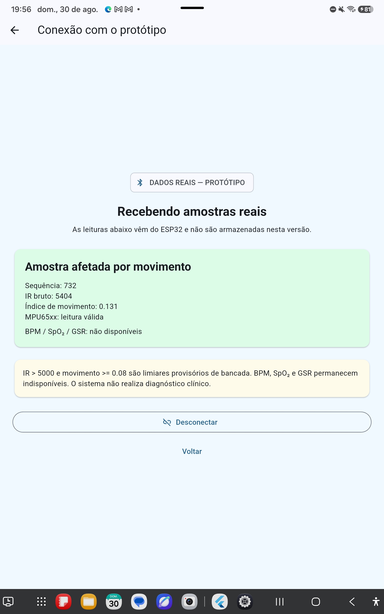
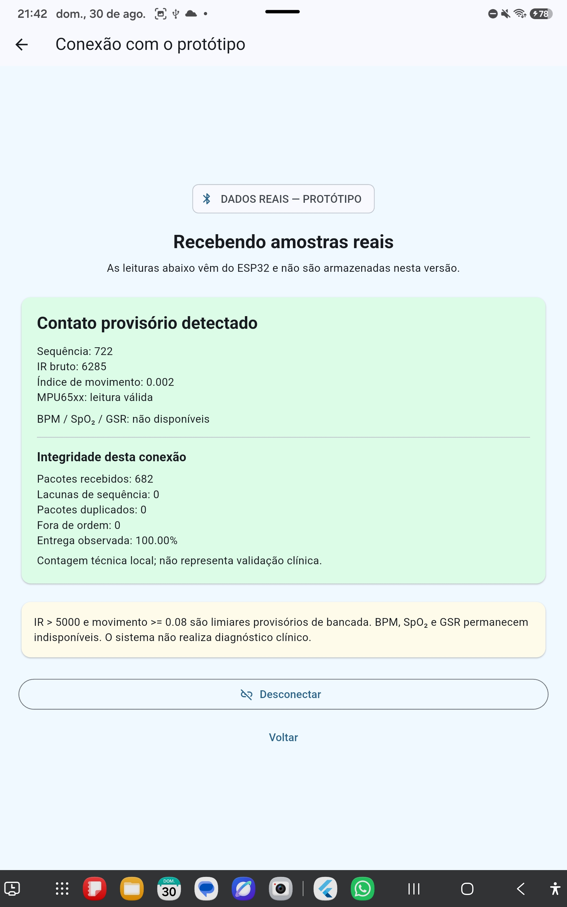

# Evidência da primeira conexão BLE real

## Identificação

- data: 30/08/2026;
- orientador e executor do ensaio: Professor Gerson Cesar Grobe de Miranda;
- dispositivo Android: tablet Samsung SM-X810;
- placa: ESP32 Dev Module com ESP32-WROOM-32;
- firmware: `bluepulse_ble_integracao.ino`;
- protocolo: BluePulse BLE v1;
- commits principais: `931169c`, `4d7b454` e `9c0db29`.

## Objetivo

Verificar se o aplicativo Android localiza o ESP32 por Bluetooth Low Energy,
conecta ao serviço BluePulse v1 e recebe amostras reais do MAX30102 e do módulo
MPU65xx compatível, sem calcular ou exibir BPM não validado.

## Procedimento e ocorrências

1. O firmware BLE foi compilado para `esp32:esp32:esp32` e gravado pela COM6.
2. A primeira tentativa de gravação falhou porque a placa não estava no modo de
   programação. O botão BOOT foi mantido pressionado durante a tentativa
   seguinte, que concluiu e verificou a gravação.
3. O monitor serial confirmou sequência crescente, IR, movimento, MPU válido e
   estado interno `BLE=ANUNCIANDO`.
4. A primeira busca no tablet falhou porque o Bluetooth estava desligado. O
   aplicativo foi corrigido para orientar ou solicitar sua ativação.
5. Com Bluetooth e permissões concedidas, a busca encontrou outros dispositivos,
   mas não o BluePulse. O aplicativo passou a executar busca diagnóstica sem
   filtro do sistema.
6. O firmware foi corrigido para colocar explicitamente o nome
   `BluePulse-ESP32` no anúncio e o UUID do serviço na resposta de varredura.
7. Após nova gravação e reinicialização, o tablet localizou, conectou e passou a
   receber notificações do ESP32.
8. O comando **Desconectar** do aplicativo encerrou a conexão de forma
   controlada e sem travamento.
9. Uma nova busca localizou novamente o protótipo, a reconexão foi concluída e
   a tela voltou ao estado **Recebendo amostras reais**.
10. O orientador confirmou que o número de sequência continuou aumentando após
    a reconexão, evidenciando a retomada das notificações BLE.

As falhas intermediárias foram preservadas porque documentam a diferença entre
o estado interno “anunciando” e um anúncio efetivamente observável pelo cliente.

## Resultado observado

A captura fornecida pelo orientador mostra:

- estado **Recebendo amostras reais**;
- sequência `732`;
- IR bruto `5404`;
- índice de movimento `0.131`;
- MPU65xx com leitura válida;
- estado **Amostra afetada por movimento**;
- BPM, SpO₂ e GSR explicitamente indisponíveis.

O resultado é compatível com o protocolo v1: o movimento observado é superior
ao limiar provisório `0.08`. O valor IR também é superior ao limiar provisório
`5000`. Esses limiares continuam sendo critérios técnicos de bancada e não
representam diagnóstico ou validação clínica.



| Arquivo | Tamanho | SHA-256 |
| --- | ---: | --- |
| `conexao-ble-real-bluepulse.jpg` | 447.361 bytes | `4F866B2DC5EA0ECDA5D1F109063EDCD3F13CA6AB591615C2BFBBF15A7AA5B133` |

## Ensaio de integridade da transmissão

Após a inclusão do contador técnico no aplicativo, foi realizada nova conexão
com o mesmo protótipo e tablet. A captura fornecida pelo orientador registra:

- sequência atual `3535`;
- IR bruto `5288`;
- índice de movimento `0.035`;
- MPU65xx com leitura válida;
- estado **Contato provisório detectado**;
- `396` pacotes recebidos;
- `0` lacunas de sequência;
- `0` pacotes duplicados;
- `0` pacotes fora de ordem;
- entrega observada de `100,00%` nessa conexão.

Na frequência nominal de uma notificação a cada 200 ms, 396 pacotes equivalem
a aproximadamente 79,2 segundos de transmissão. Esse tempo é uma estimativa
derivada da frequência configurada, não uma medição independente de relógio.
O resultado demonstra integridade completa somente no intervalo e nas condições
desse ensaio; não autoriza generalização para outras distâncias, interferências
ou durações.


| Arquivo | Tamanho | SHA-256 |
| --- | ---: | --- |
| `integridade-ble-396-pacotes.jpg` | 550.021 bytes | `2BFCA09612D1A807DA4420793698ACB3D591989CD602D1438905B73AC907132A` |

### Repetição ampliada na bancada

Uma nova conexão foi observada por intervalo maior. A segunda captura registra:

- sequência atual `722`;
- IR bruto `6285`;
- índice de movimento `0.002`;
- MPU65xx com leitura válida;
- estado **Contato provisório detectado**;
- `682` pacotes recebidos;
- `0` lacunas de sequência;
- `0` pacotes duplicados;
- `0` pacotes fora de ordem;
- entrega observada de `100,00%` nessa conexão.

Na frequência nominal de uma notificação a cada 200 ms, 682 pacotes equivalem
a aproximadamente 136,4 segundos. A contagem maior reproduziu o resultado de
integridade do primeiro ensaio nas mesmas condições gerais de bancada. Ela não
mede latência e não demonstra o comportamento em outras distâncias, fontes de
interferência ou períodos prolongados.



| Arquivo | Tamanho | SHA-256 |
| --- | ---: | --- |
| `integridade-ble-682-pacotes.jpg` | 549.416 bytes | `940F32D5001F0789AF3F02BC2BB1F223C29E3C414EA2FF74CD7A30CF369EB8A8` |

## Comparação simultânea entre USB serial e BLE

Para verificar se o aplicativo preserva os valores produzidos pelo firmware,
o monitor USB da COM6 foi mantido em `115200` baud enquanto o tablet continuava
recebendo notificações por BLE. O log serial foi gravado sem reinicializar o
ESP32 e a tela do tablet foi capturada durante a mesma coleta.

A sequência `2427` foi localizada no log e comparada campo a campo:

| Campo | Monitor serial do ESP32 | Aplicativo no tablet | Resultado |
| --- | ---: | ---: | --- |
| sequência | `2427` | `2427` | idêntico |
| IR bruto | `6275` | `6275` | idêntico |
| movimento | `0.069` | `0.069` | idêntico |
| MPU65xx | `OK` | leitura válida | semanticamente idêntico |
| estado BLE | `CONECTADO` | recebendo amostras reais | coerente |

A linha original preservada é:

```text
SEQ=2427 | IR=6275 | MOV=0.069 | MPU=OK | BLE=CONECTADO
```

O log contém 484 linhas consecutivas, da sequência `2139` à `2622`. A captura
do tablet registra, na mesma conexão, `2387` pacotes recebidos, 0 lacunas, 0
duplicações, 0 pacotes fora de ordem e entrega observada de 100,00%. Como a
sequência atual é `2427`, os contadores são consistentes com uma conexão
iniciada na sequência `41`. Na taxa nominal de 200 ms, 2387 pacotes equivalem a
aproximadamente 477,4 segundos, ou 7 minutos e 57,4 segundos.

Essa comparação aprova a preservação dos campos do pacote BluePulse BLE v1
nesta amostra e neste ensaio. Ela não mede latência, pois o pacote atual não
transporta timestamp e não foi usada uma referência temporal independente.


| Arquivo | Tamanho | SHA-256 |
| --- | ---: | --- |
| `comparacao-serial-ble-sequencia-2427.jpg` | 551.142 bytes | `4984112B11A4D596407ED37F28DE1DA32B0311669B57B56E5272D759B3EA78A6` |
| `comparacao-serial-ble.log` | 27.600 bytes | `524C2CB9DF059E23D1983572D110D234A7F51B9B3C0B2AD2526B48E84C2DB67F` |

O log completo está em
[`logs/2026-08-30/comparacao-serial-ble.log`](logs/2026-08-30/comparacao-serial-ble.log).

## Verificações técnicas anteriores ao ensaio

| Verificação | Resultado |
| --- | --- |
| compilação do firmware BLE | aprovada |
| gravação e verificação da flash | aprovada |
| inicialização de MAX30102 e MPU65xx | observada pela saída serial |
| análise estática Flutter | nenhuma ocorrência |
| testes automatizados Flutter | 14 aprovados |
| compilação e instalação Android | aprovadas |
| localização e conexão BLE | aprovadas no tablet |
| recepção de notificações reais | aprovada no tablet |
| desconexão comandada pelo aplicativo | aprovada no tablet |
| nova localização e reconexão | aprovadas no tablet |
| retomada da sequência de notificações | aprovada; sequência crescente observada |
| integridade em uma conexão de 396 pacotes | aprovada; 0 lacunas, 0 duplicações e 0 fora de ordem |
| repetição ampliada com 682 pacotes | aprovada; 0 lacunas, 0 duplicações e 0 fora de ordem |
| comparação da mesma amostra por serial e BLE | aprovada na sequência 2427; campos idênticos |
| integridade ampliada até 2387 pacotes | aprovada; 0 lacunas, 0 duplicações e 0 fora de ordem |

## Limites e próximos testes

Esta evidência valida a primeira conexão, a recepção, a desconexão controlada e
a reconexão com retomada das notificações. Ainda permanecem pendentes:

- repetição da medição de perda, duplicação e ordem em outras condições;
- medição específica de atraso com referência temporal independente;
- repetição controlada dos estados sem contato, contato e movimento;
- validação específica de qualidade de sinal antes de qualquer BPM.

O sistema não realiza diagnóstico clínico, não infere estresse ou ansiedade e
não deve orientar decisões médicas.
