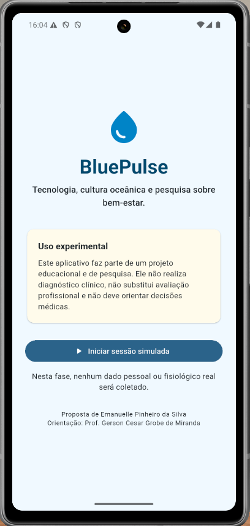
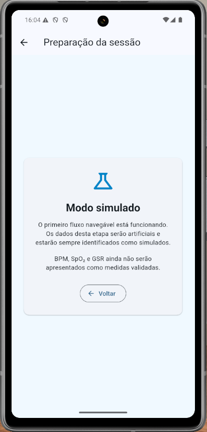

# Evidência da primeira execução Android

## Identificação

- data: 30/08/2026;
- etapa: preparação do ambiente e primeiro incremento do aplicativo;
- plataforma: Android 16, API 36;
- dispositivo: emulador `Pixel_7a`, identificado como `emulator-5554`;
- origem dos dados: nenhum dado fisiológico; somente interface estática.
- commit do aplicativo verificado: `e4cf3c6`;

## Versões principais

| Componente | Versão |
| --- | --- |
| Flutter | 3.47.2 estável, revisão `d3b14c8769` |
| Dart | 3.13.2 |
| Android SDK | 36.0.0 |
| Android Build Tools | 36.0.0 |
| Android Command-line Tools | 23.0.0 |
| Android NDK | 28.2.13676358 |
| JDK | OpenJDK 21.0.5, fornecido pelo Android Studio |

## Procedimento

1. Criar o projeto Flutter Android com identificador
   `com.cesargrobe.bluepulse_app`.
2. Implementar a apresentação, o aviso experimental e a preparação simulada.
3. Executar formatação e análise estática.
4. Executar os testes de interface.
5. Compilar o APK de depuração.
6. Iniciar o emulador, instalar o APK e abrir a atividade principal.
7. Confirmar a atividade ativa e os textos da interface pela árvore de
   acessibilidade do Android.
8. Acionar o botão inicial e confirmar a abertura de `Modo simulado`.

## Resultados observados

| Verificação | Resultado |
| --- | --- |
| análise estática | sem problemas |
| testes automatizados | 2 de 2 aprovados |
| compilação Android | `app-debug.apk` gerado |
| instalação no emulador | sucesso |
| atividade principal | ativa, visível e em primeiro plano |
| aviso experimental | presente |
| autoria e orientação | presentes |
| navegação para modo simulado | sucesso |
| retorno automatizado | aprovado no teste de interface |

O texto verificado no Android declara que o aplicativo não realiza diagnóstico
clínico, não substitui avaliação profissional e não deve orientar decisões
médicas. A tela seguinte identifica explicitamente os dados como simulados e
informa que BPM, SpO₂ e GSR ainda não são medidas validadas.

## Exceções e limitações

O diagnóstico do Flutter informa `Android license status unknown`. A Android
Command-line Tools 23.0.0 declara que o comando legado `sdkmanager --licenses`
não é mais necessário, enquanto o Flutter 3.47.2 ainda espera esse mecanismo.
Essa diferença não impediu download oficial de componentes, compilação,
instalação nem execução e, por isso, foi registrada como exceção não bloqueante.

O emulador foi executado sem janela para permitir automação. A captura gráfica
resultou preta por limitação do renderizador nesse modo. A execução não foi
inferida pela captura: foi confirmada pelo estado da atividade, pela árvore de
interface do Android e pela navegação efetiva entre as duas telas.

## Validação visual pelo orientador

Após a execução do aplicativo com a janela visível do emulador, o Professor
Gerson Cesar Grobe de Miranda verificou as duas telas e informou que estava
“tudo certo”. Foram confirmados:

- tela inicial completa e legível;
- aviso de uso experimental sem texto cortado;
- autoria da proposta e orientação apresentadas corretamente;
- abertura da preparação da sessão pelo botão correspondente;
- identificação explícita do modo simulado;
- funcionamento do retorno à tela anterior.

As capturas fornecidas pelo orientador foram preservadas sem edição:

Hashes SHA-256 dos arquivos originais:

| Arquivo | SHA-256 |
| --- | --- |
| `tela-inicial-bluepulse.png` | `5D61C11250C45BA17E8AC62DAD379F68EB567382A5C99121A578919884506FCA` |
| `modo-simulado-bluepulse.png` | `D17BA3D2E639E393113191E51EFA6E29D6D004CB5F22282FE562F05936EE7E13` |

## Decisão

O ambiente Android está apto, o item 2 do plano foi concluído com a exceção
acima documentada e o item 3 foi iniciado. A renderização visível deste primeiro
incremento foi aprovada. Ainda será necessária nova avaliação quando todas as
telas previstas para o primeiro fluxo navegável estiverem implementadas.
