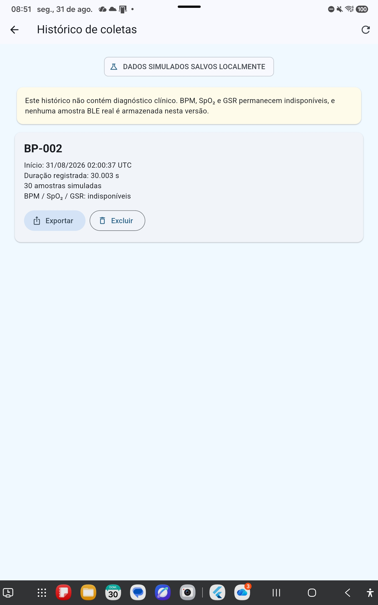

# Evidência do histórico de sessões simuladas

## Identificação

- data: 31/08/2026;
- responsável pela implementação: Codex, sob orientação do Professor Gerson
  Cesar Grobe de Miranda;
- dispositivo de instalação: tablet Samsung SM-X810;
- natureza dos dados: exclusivamente simulados;
- sessão preservada para o portão manual: `BP-002`.

## Objetivo

Permitir que o orientador consulte coletas simuladas salvas na área privada do
aplicativo após sair da tela de monitoramento ou reiniciar o aplicativo. A tela
não habilita persistência de amostras BLE reais e não apresenta interpretação
clínica.

## Fluxo implementado

1. A tela inicial oferece **Histórico de coletas simuladas**.
2. Ao abrir, o aplicativo lê os arquivos JSON da pasta privada
   `bluepulse_sessions`.
3. Para cada coleta, apresenta código anônimo, início em UTC, duração registrada,
   quantidade de amostras e indisponibilidade de BPM, SpO₂ e GSR.
4. A coleta pode ser exportada novamente em CSV e JSON.
5. A exclusão exige confirmação e atualiza a lista imediatamente.
6. A tela diferencia carregamento, histórico vazio e falha de leitura e permite
   atualização manual.

## Limites preservados

- somente sessões simuladas explicitamente salvas são listadas;
- amostras recebidas por BLE permanecem somente na memória;
- não há sincronização pela internet;
- não há nome, e-mail ou outro cadastro nominal;
- o sistema não realiza diagnóstico clínico e não deve orientar decisões
  médicas;
- `IR > 5000` e `movimento >= 0.08` continuam sendo limiares provisórios de
  bancada.

## Verificação automatizada

| Verificação | Resultado |
| --- | --- |
| repositório grava e relê uma sessão | aprovada |
| tela apresenta sessão existente | aprovada |
| recriação da tela recupera a mesma sessão | aprovada |
| estado sem sessões | aprovado |
| exclusão após confirmação | aprovada |
| análise estática Flutter | nenhuma ocorrência |
| testes automatizados | 24 aprovados |
| compilação Android de depuração | aprovada |
| instalação preservando dados do aplicativo | aprovada |
| recuperação visual de `BP-002` após reabertura | aprovada pelo orientador |

O APK possui 180.104.326 bytes e SHA-256
`FCCB1BDCB8CBF6090CC975AB8B2DF147E336F8515C8EA2CEBEA240F193EC5647`.

## Verificação técnica no tablet

Antes da instalação, a coleta `BP-002` já estava na área privada do aplicativo.
O APK foi instalado com atualização preservando dados. Em seguida, o aplicativo
foi encerrado à força e aberto novamente. A inspeção da pasta privada após a
reinicialização confirmou que o JSON `BP-002` permanecia em
`app_flutter/bluepulse_sessions`.

Essa inspeção comprova a permanência do arquivo no armazenamento do aplicativo.

## Confirmação visual pelo orientador

Após desbloquear o tablet e abrir o histórico, o orientador confirmou a
apresentação da coleta `BP-002` com início em `31/08/2026 02:00:37 UTC`, duração
de `30.003 s`, 30 amostras simuladas e BPM, SpO₂ e GSR indisponíveis. A tela
também apresentou as ações de exportação e exclusão e manteve explícito que
nenhuma amostra BLE real é armazenada.

| Artefato | Tamanho | SHA-256 |
| --- | ---: | --- |
| `historico-bp-002-apos-reabertura.jpg` | 332.966 bytes | `4370D58DF9D159E415F768A9D1E9C73F1C7E1E95CEF4DFBE94AD66FD26332970` |

Com essa confirmação, o portão de persistência e recuperação de coletas
simuladas após reinicialização está concluído. Isso não autoriza armazenamento
de dados fisiológicos reais, que depende de política própria e revisão ética.
